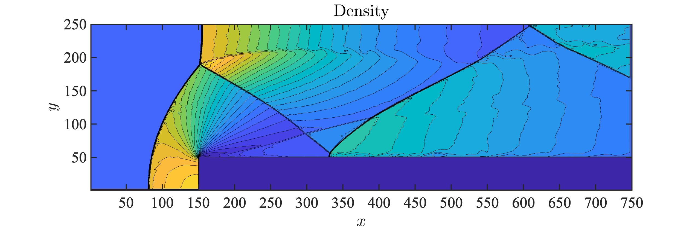

# weno5-2D
weno5 二维算法，使用 Matlab 编写。

## 文件目录

```shell
.
├── U2W.m U 变量转原始变量 W
├── W2U.m 原始变量 W 转 U 变量
├── bc.m 边界条件设置
├── draw.mlx 画图
├── job.sh 提交作业
├── main1.m 主程序
├── W.mat 最终计算结果 
├── weno5.m
└── wm2
    └── main1.m 在超算上运行的主程序
```

## 问题和算法

- 前台阶问题的详细[说明](https://github.com/circlelq/Computational-Fluid-Dynamics/tree/main/code3)
- WENO5 算法[说明](https://github.com/circlelq/Computational-Fluid-Dynamics/tree/main/code2)

## 结果

$t=4$ 的结果，网格数 $250\times 750$，$\mathrm{CFL}=0.8$ 



网格数 $50\times 150$ 的视频其它数据见链接: https://pan.baidu.com/s/1XqeJ2tA-KUSduQFhX0Kl2Q  密码: 01s8 中的 WENO5 文件夹。
